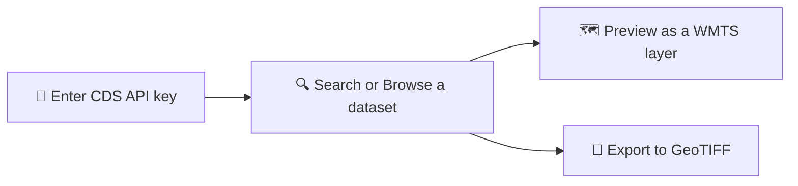
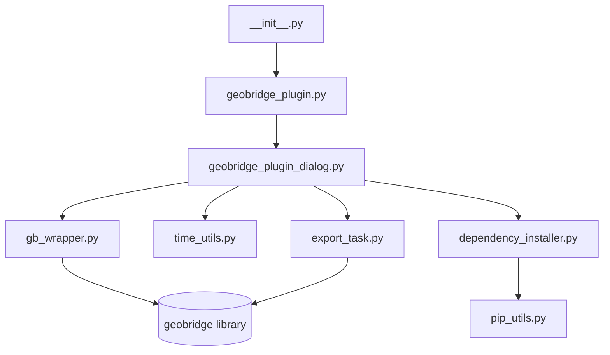

<p align="center">
  
</p>

<h1 align="center">GeoBridge</h1>

<p align="center">Access and integrate C3S climate data directly in QGIS.</p>

<p align="center">
  <a href="LICENSE"></a>
  
  <a href="https://geobridge-qgis.readthedocs.io/en/latest/?badge=latest"></a>
  
  
</p>

> **Disclaimer:** GeoBridge was built by the participants listed under [Authors](#-authors)
> as part of an ECMWF-affiliated open-source program. It is an independent community
> contribution — **not an official ECMWF product**, and not maintained or supported by ECMWF.

A QGIS 3 plugin that discovers, semantically searches, and previews Copernicus climate data
(ERA5, CAMS, CEMS) as WMTS layers directly in QGIS, and exports selections to GeoTIFF — built
entirely on QGIS's own bundled GDAL, with no extra Python packages to install.

**Requirements:** QGIS ≥ 3.28, with **GDAL ≥ 3.9** for full functionality. QGIS 3.28+ alone
covers almost everything, but a handful of datasets use the newer Zarr V3 format, which needs
GDAL 3.9+ (bundled with roughly **QGIS 3.38+** on Windows — on Linux this varies by
distro/package source, so check directly: `python3 -c "from osgeo import gdal;
print(gdal.__version__)"`, or via QGIS's own Python Console) to read. On an older GDAL those
specific datasets fail with a "Variable not found in Zarr store" error — see
[Installation](https://geobridge-qgis.readthedocs.io/en/latest/installation.html) for details.

<p align="center">
  
</p>



## 📖 Documentation

Full docs (installation, and a walkthrough of each tab with screenshots) are built with
Sphinx from the `docs/` folder — see `docs/index.rst` to read the source directly, or
connect this repo at [readthedocs.org](https://readthedocs.org) to publish it at
`https://geobridge-qgis.readthedocs.io`.

## 🚦 Status

v1 (this release): API key tab + Search/WMTS-viewer tab. GeoTIFF export
(`zarr_to_geotiff`/`cds_to_geotiff`) is designed (`export_task.py`) but not yet wired to the
UI — the "Export to GeoTIFF" button is present but disabled, pending a dedicated pass to
handle the GDAL/rasterio version-conflict risk on Windows (see `export_task.py`'s docstring).

## 🛠️ Development setup

This plugin's working copy lives directly under the QGIS profile's plugin folder, so edits
take effect on the next reload — no build/deploy step:

```
.../AppData/Roaming/QGIS/QGIS3/profiles/default/python/plugins/GeoBridge_Plugin
```

Edit the files there directly — there is no separate dev copy elsewhere.

Install the [Plugin Reloader](https://plugins.qgis.org/plugins/plugin_reloader/) QGIS plugin
and assign it a shortcut to reload GeoBridge_Plugin after saving changes, without restarting
QGIS.

### 📦 Installing `geobridge` itself

Don't `pip install` it yourself into QGIS's Python. Open the plugin, go to the API key tab —
if `geobridge` isn't importable yet, an "Install dependencies" button appears and installs it
into the exact Python interpreter QGIS is running (`sys.executable -m pip install geobridge`).
After it finishes, reload the plugin via Plugin Reloader (a full QGIS restart is not needed
for this tier).

### ✅ Running the plain-Python tests

`time_utils.py` and the non-network parts of `gb_wrapper.py` have zero PyQt/`qgis` imports and
run under plain `pytest`, no QGIS installation required:

```bash
pip install -r requirements.txt pytest
pytest test/
```

Everything else (the dialog, WMTS layer rendering, dependency installer) has to be tested
manually inside a real QGIS session — see the "Verification" section of the project's
implementation plan for the manual test checklist.

## 🏗️ Architecture



```
__init__.py                     -> classFactory(iface)
geobridge_plugin.py              -> main plugin class (initGui/unload/run)
geobridge_plugin_dialog.py        -> QTabWidget dialog (Tab 1: API key, Tab 2: Search + WMTS viewer)
geobridge_plugin_dialog_base.ui   -> Qt Designer UI file
gb_wrapper.py                    -> ALL geobridge calls live here (zero PyQt/qgis imports)
time_utils.py                    -> pure time-step math (zero Qt imports, unit-testable)
pip_utils.py                     -> pure subprocess/pip helper (zero Qt imports)
dependency_installer.py          -> QThread wrapping pip_utils, emits Qt signals
export_task.py                   -> QgsTask for GeoTIFF export (Phase 2, not yet wired to UI)
```

`gb_wrapper.py` never imports `geobridge` at module scope — every function imports it
internally, so the plugin package itself always imports cleanly even before `geobridge` is
installed (otherwise QGIS would disable the plugin with a red error icon before the user ever
sees the "Install dependencies" button).

Map layers are always built via `geobridge.wmts_layer(...).to_qgis()` (the XYZ-tile approach,
confirmed working in QGIS 3.28+) — never via `LayerDescriptor.to_qgis()` directly, which
builds a WMS-provider URI that QGIS cannot reliably parse against ECMWF's WMTS server (see
`geobridge/modules/wmts.py`'s module docstring in the main GeoBridge repo for why).

## ⚖️ License

MIT. See `LICENSE`.

## 👥 Authors

Built as part of an ECMWF-affiliated open-source program. This is an independent participant
project, not an official ECMWF product, and it isn't maintained or supported by ECMWF.

**Mentors**
- Angel Lopez Alos
- Samuel Almond

**Participants**
- Ilias Machairas
- Konstantinos Fokeas
