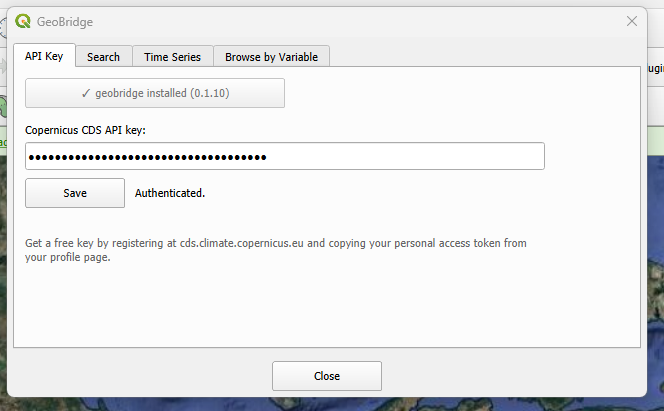

API Key Tab
============

The first tab handles two things: getting the ``geobridge`` library
installed, and authenticating against the Copernicus Climate Data Store.

Dependency status
------------------

At the top, a button shows whether ``geobridge`` (and its export-support
extras) are installed into QGIS's own Python:

* **"Install dependencies"** — not installed yet, or only partially
  installed. Clicking it installs everything needed.
* **"✓ geobridge installed (version)"** — fully installed and ready; the
  button is disabled.

See :doc:`installation` for what exactly gets installed and why.

API key
--------

* **Copernicus CDS API key** — paste your personal access token from your
  CDS profile page here. The field is masked by default; click the eye
  icon inside it to reveal or re-hide what you typed.
* **Save** — stores the key (via QGIS's ``QSettings``) and immediately
  attempts to authenticate with it. The status label next to the button
  reports the result ("Authenticated." or an error message).

Search and quick WMTS previews (:doc:`search_tab`, :doc:`browse_tab`) work
without a saved key. An authenticated key is only required for:

* GeoTIFF export (both the Search tab's ARCO Zarr export and the Browse
  tab's CDS API download).
* "Full history" time series on the :doc:`time_series_tab`.
