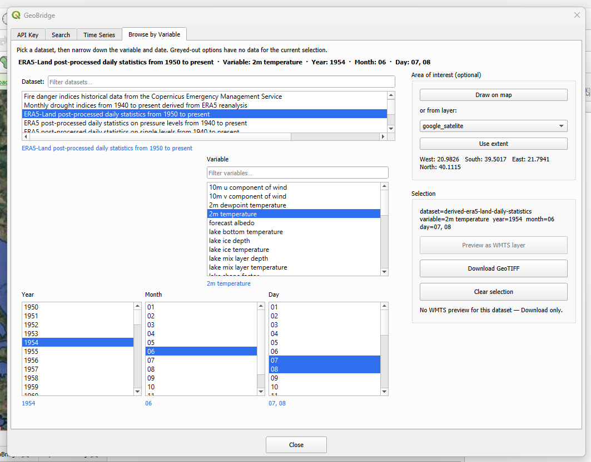

Browse by Variable Tab
========================

Unlike the free-text :doc:`search_tab`, this tab lets you pick a dataset
and narrow it down explicitly — useful once you already know which
dataset/variable/date you want, including datasets not covered by the
semantic search index.

Cascading selection
----------------------

The **Dataset** list is restricted to datasets present in ``geobridge``'s
bundled ``cds_snapshot.yaml`` catalogue — the genuine CDS/ADS STAC
catalogue snapshot, as opposed to a handful of ARCO/Zarr-only entries
``geobridge.discover()`` also returns that have no corresponding CDS
catalogue entry.

Pick a **Dataset** from the filterable list, then a **Variable**, then
**Year** / **Month** / **Day**. Each list only offers what's actually
available given everything already picked — options with no data for the
current selection are greyed out rather than removed, so you can see what
exists without losing your place. The summary line at the top of the tab
always reflects the current combination.

Area of interest
-------------------

Optional — same mechanism as the :doc:`search_tab`'s (**Draw on map** or
**from layer** + **Use extent**), but tracked **independently**: setting
an area here does not affect the Search tab's area, and vice versa.

Download
-----------

The **Selection** panel on the right shows the exact request that will be
sent, plus two actions:

* **Download GeoTIFF** — submits the request through the CDS API job
  queue and converts the result to GeoTIFF once it completes. This runs
  as a background task and can take anywhere from minutes to hours
  depending on the CDS queue; needs an authenticated API key (see
  :doc:`api_key_tab`) and the export dependencies installed.
* **Clear selection** — resets the cascade back to nothing picked.
