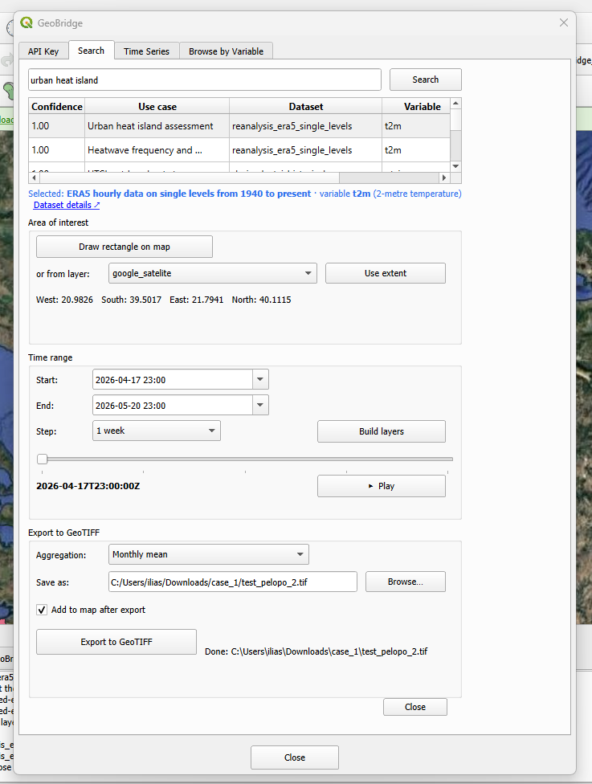

Search Tab
===========

The Search tab resolves a plain-language description of what you're after
(a "use case") into concrete Copernicus datasets/variables, then lets you
preview them as a time-stepped WMTS layer and optionally export a
GeoTIFF.

Semantic search
-----------------

Type a phrase like *"urban heat island"* or *"PM2.5 exposure"* into the
search box and click **Search** (or press Enter). Results are ranked by
confidence and show the matched use case, dataset, and variable. Clicking
a row selects it — the line below the table ("Selected: …") confirms the
dataset and variable, with a link to the dataset's public CDS catalogue
page.

Area of interest
-------------------

Optional — leave unset to work with the whole globe.

* **Draw rectangle on map** — hides the dialog, drag a rectangle on the
  QGIS map canvas, and the dialog reappears with the bounds filled in.
* **or from layer** — pick an existing layer from the dropdown and click
  **Use extent** to use its bounding box instead.

The chosen area is shown as West/South/East/North in degrees.

.. note::
   This tab's area of interest is independent from the
   :doc:`browse_tab`'s — setting one does not affect the other.

Time range and WMTS preview
------------------------------

Set **Start**, **End**, and a **Step** (e.g. daily/weekly/monthly), then
click **Build layers**. This adds one WMTS raster layer per time step to
the map (grouped together in the layers panel). The slider below scrubs
through the built steps, and **Play** animates through them automatically.

Export to GeoTIFF
--------------------

Only available for datasets on the ARCO Zarr path (``has_zarr``) — an area
of interest must be set first.

* **Aggregation** — how to reduce the time range (e.g. raw, monthly mean).
* **Save as** — output ``.tif`` path (**Browse…** to pick one).
* **Add to map after export** — load the resulting GeoTIFF as a layer once
  done.
* **Export to GeoTIFF** — runs the export as a background QGIS task; the
  status line below shows progress and the final output path.
