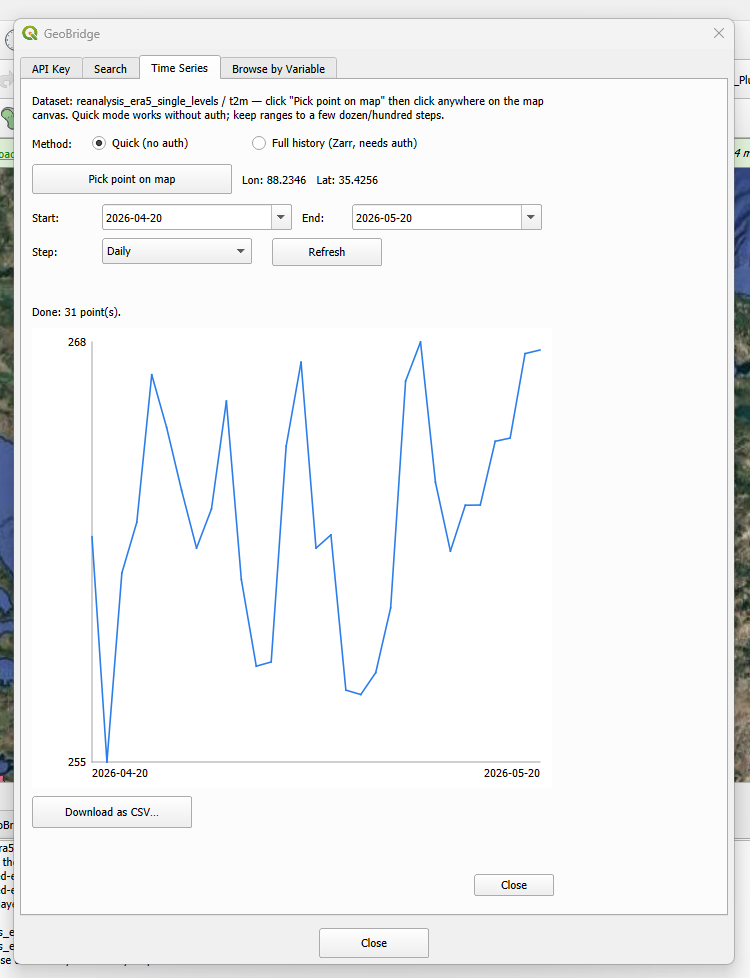

Time Series Tab
=================

Fetches how a single point's value changes over time, for the
dataset/variable currently selected on the :doc:`search_tab`.

This tab has no dataset picker of its own — a "Selected dataset: …" /
"variable …" block at the top (with a hoverable info icon) always shows
which dataset/variable it's currently reading from, so it's clear this
reflects the Search tab's selection rather than something chosen here.

Picking a point
------------------

Click **Pick point on map**, then click anywhere on the QGIS map canvas.
The clicked point's longitude/latitude are shown next to the button.
Clicking a new point while a fetch is still running cancels it and starts
a fresh one for the new point.

Method
--------

* **Quick (no auth)** — one WMTS ``GetFeatureInfo`` request per time step.
  No authentication or extra installation needed; best for exploratory
  ranges up to a few dozen/hundred steps.
* **Full history (Zarr, needs auth)** — one bulk read off the ARCO Zarr
  archive. Needs the ``geobridge[zarr]`` extra installed and an
  authenticated CDS API key (see :doc:`api_key_tab`); best for long or
  dense ranges. Disabled entirely when the selected dataset has no ARCO
  Zarr archive to read from — "Quick" is the only option for those.

Range and results
--------------------

Set **Start**, **End**, and a **Step** (daily/weekly/monthly), then click
**Refresh** to (re-)fetch. The status line reports how many points came
back, and the chart plots value against time — a gap in the data (a
``None`` value) breaks the line rather than interpolating across it.

**Download as CSV…** saves the currently plotted samples to a file.
